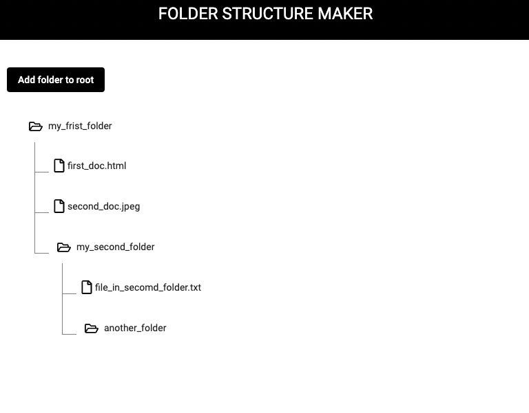

# FSM - Folder Structure Maker

 

  

  

    A simple application that renders a folder structure from JSON file.
     
  

## Requirements
Build an angular application that allows you to create and render a folder structure. The ui should be backed by a JSON representation of the folder structure. The structure consists of “nodes” which are either files or folders.  

The user should be able to add a root folder to the tree via the “add folder to root” button.  
The user should be able to name the newly created node. Once named, it does not need to be renamable. 
The only validation required on the naming of a node is that the name can’t be left blank. If it is, the file/folder should be deleted. 
A newly added node can be cancelled by pressing the cancel button during naming. 
The user should be able to add a node as a child to a folder by clicking a button that becomes visible on a folder upon hover. The user should not be able to add a child node to a file. 
Upon adding a child node to a folder, the user should be presented with two buttons to decide if the newly added child node is a file or a folder. 
The user should be able to delete a node via a delete button that becomes visible on a file or folder upon hover. 
A JSON object representing the folder structure should be visible in a read-only text area at the bottom of the page. 
The following model should be used to represent a file or folder node. You can extend it or modify it if your solution requires it. A copy of this file can be found in the resources folder. 

